# SOCC-Bench

**Small and Occluded object detection from a low-altitude UAV: a benchmark where
difficulty is a measured physical quantity, not a label someone assigned.**


**At a glance**

- A YOLOv8n baseline finds **97.6 %** of targets larger than 32 px but only
  **8.5 %** of targets smaller than 12 px, an eleven-fold collapse that its
  mAP@0.5 of 0.676 does not show.
- About **91 %** of sub-12-pixel targets produce no box of any class: the failure
  is detection, not classification.
- Neither a stride-4 P2 detection level, CBAM attention, a two-stage detector nor
  a transformer detector clears the pre-registered **+0.02** recall floor at a
  comparable box budget.
- One configuration does: a P2 detection level trained with small-object
  augmentation and run with 2 × 2 tiled inference raises sub-12-pixel recall from
  0.085 to **0.112** (+0.027, 95 % CI [+0.015, +0.035]). It is a secondary hypothesis,
  bought with an estimated four network passes per frame.

**Contents:**
[Why](#why-another-small-object-benchmark) ·
[Corpus](#the-corpus) ·
[Protocol](#the-evaluation-protocol) ·
[Results](#results) ·
[Limitations](#limitations) ·
[Open questions](#open-questions) ·
[Repository](#repository-layout) ·
[Reproducing](#reproducing-the-numbers) ·
[Data format](#data-format) ·
[Licence](#licence-and-citation)

---

## Why another small-object benchmark

General-purpose benchmarks such as PASCAL VOC and MS COCO are dominated by medium
and large objects. Aerial benchmarks such as DOTA, VisDrone and UAVDT do contain
small and occluded targets (UAVDT even labels occlusion), but as they happened to
occur, and results on them are usually reported as one aggregate score from one
training run.

They record *that* a frame was hard, not *why*. Was the target small because the
aircraft was far away or because the image was downscaled? Was it occluded by 20 %
or by 80 %? A benchmark that cannot separate those questions cannot say which fix
worked. Here both axes are **set during the flight and measured afterwards**:

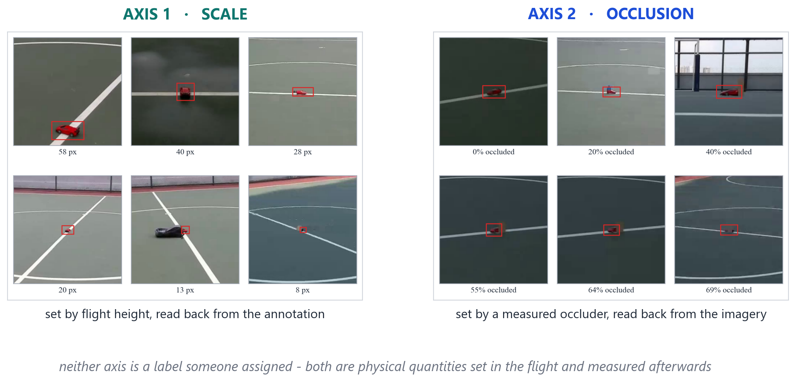

- **Scale** is set by flying higher. Frames are never downscaled: the target shrinks
  because the aircraft climbed, and its size is read back from every annotation,
  from nearly 100 px down to under 3 px.
- **Occlusion** is set by a physical occluder of known width standing in the scene,
  deployed at 25, 50 and 75 % of the target's length. The value used is the
  occlusion *measured* in each frame, not the level the flight requested, and the
  two disagree for most frames: on the 75 % lap, only 116 of 508 frames measure as
  heavily occluded.

*Occlusion percentages in the figures are the measured values for those frames;
readings below about 32 % are within the measurement's noise
([Occlusion](#occlusion)).*

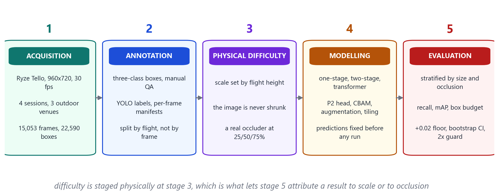

---

## The corpus

**15,053 released frames · 22,590 instances · 3 vehicle classes · 4 sessions ·
3 outdoor venues**

### Capture

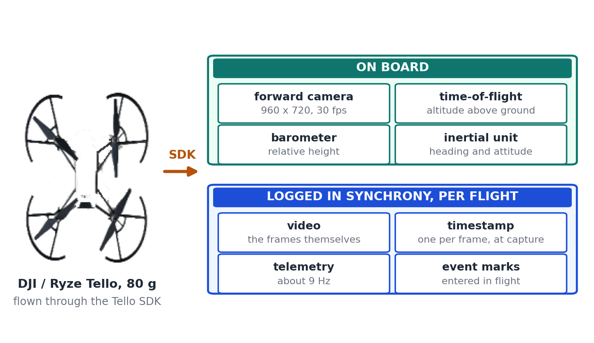

Every frame comes from an 80 g Ryze Tello flown through its SDK. The forward
camera records 960 × 720 video at 30 fps, pitched about 11° below the horizon, and
every flight logs time-of-flight altitude, barometric height, heading and battery at
about 9 Hz (pitch and roll as well from S2 on), the time of every video frame, event
marks entered during the flight and, at S4, the stick commands flown. The logs of all
39 recordings are in [`capture/captures/`](capture/captures); every time in them is
seconds from the start of its recording.

Flights follow fixed **flight cards**: hover pairs, size sweeps at rising height,
*paired orbits* (a clean lap around the target, then the same lap with the occluder
deployed at 25, 50 or 75 %), multi-target passes, and negatives with no target in
the scene. Frames were sampled from the video at about 3 fps. At the park deck the
recorder delivered 22.6–24.9 fps with about 19 % of exposures lost over Wi-Fi, so its
3,416 frames were selected from 27,134 extracted ones on a de-jittered clock whose
spacing sits at the limit set by that random frame loss.

### Sessions and venues

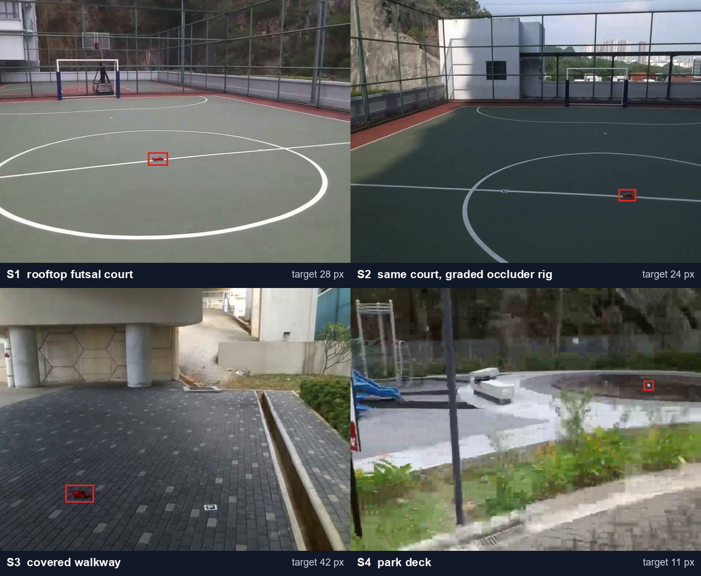

| Session | Venue | Frames | Instances | Classes | Median size | < 12 px | Median height (95th pct) |
|---|---|---:|---:|---|---:|---:|---:|
| S1 | rooftop futsal court | 5,168 | 3,691 | car | 30.1 px | 14 | 2.0 m (3.7 m) |
| S2 | same court, graded occluder rig | 3,240 | 2,689 | car | 26.3 px | 33 | 2.7 m (3.2 m) |
| S3 | covered walkway | 3,229 | 9,227 | all three | 26.5 px | 80 | 2.6 m (5.7 m) |
| S4 | park deck | 3,416 | 6,983 | all three | 19.0 px | 1,287 | 3.9 m (7.2 m) |
| **Total** | | **15,053** | **22,590** | | **25.5 px** | **1,414** | |

*Size is √(box area) at 960 × 720, the COCO definition, measured from the released
labels. Height is the time-of-flight altitude over airborne frames. 2,963 frames carry
no box: negatives, frames where the target has left the field of view, and the 159
frames in which it is completely hidden. 34 further frames (5 in S1, 29 in S2) were
reviewed and withheld because the target could not be located or the frame was
corrupt; none carries a box, so every instance is in the release.*

### Targets

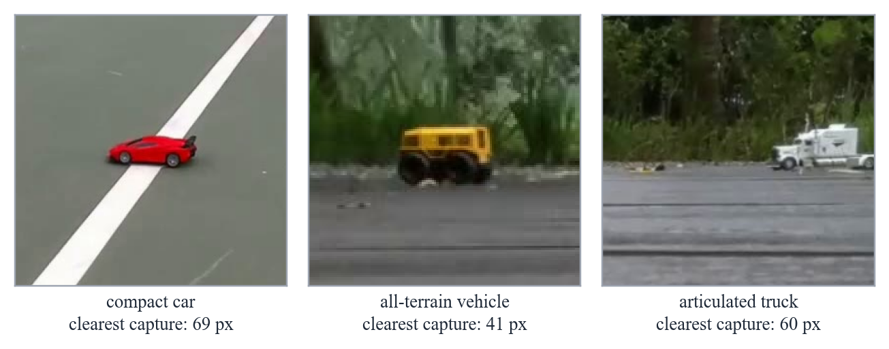

Three radio-controlled vehicles of distinct aspect ratio: a compact car
(`rc_car`, 216 × 90 × 60 mm), an all-terrain vehicle (`atv_sherp`) and an articulated
truck (`truck_peterbilt`). S1 and S2 contain the car alone; S3 and S4 contain all
three.

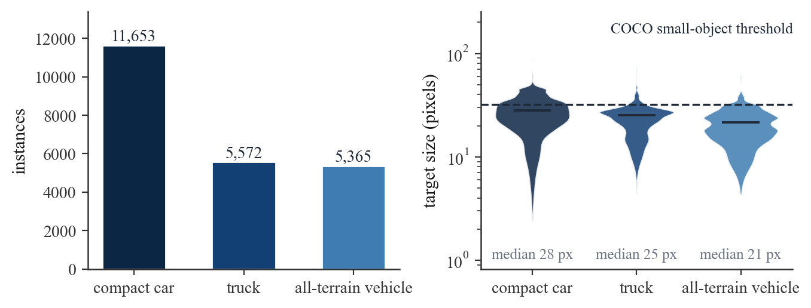

### Annotation

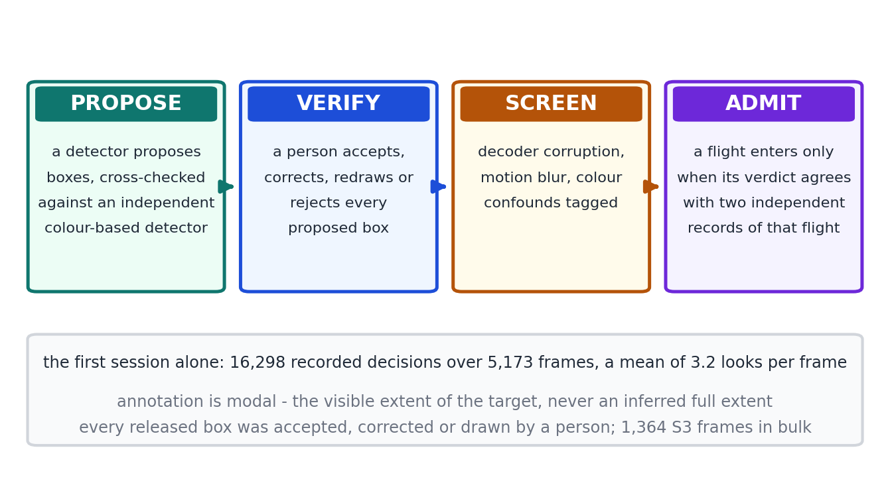

Boxes are **modal**: the visible extent of the target, never an inferred full
extent. A detector proposed boxes, cross-checked against an independent colour-based
detector; a person then accepted, corrected, redrew or rejected every proposal;
decoder corruption, motion blur and colour confounds were tagged; and a flight was
admitted only when its verdict agreed with two independent records of that flight.
In S3 the proposals on 1,364 frames were accepted in bulk and 1,865 frames were
confirmed individually; the S3 release manifest records which, per frame.

### Size

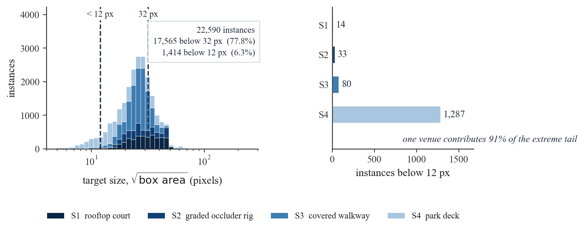

77.8 % of all instances are COCO-small (under 32 px) and 6.3 % fall below 12 px.
The extreme tail belongs almost entirely to one venue: the park deck holds 1,287 of
the 1,414 sub-12-pixel instances.

<details>
<summary><b>Why sizes are reported in pixels, not millimetres</b></summary>

At the rooftop court an ArUco marker of 96.3 mm side gives an exact ground sampling
distance *at the marker's plane*; pose estimation from the marker puts the focal
length at 947 px and the camera's depression at 11.0°. Applied to the car, whose
length was measured with a ruler at 216 mm, that scale reads a median of 237 mm over
the 267 frames of the S1 flight cards in which marker and car are both visible, 10 %
long, because the car sits nearer the camera than the marker. The scale chain is
consistent at the marker plane and not valid away from it, so every size in this
repository is in pixels and no metric size is claimed. The per-frame marker scale is
in the `gsd_at_mat_mm_px` manifest column wherever a marker was detected.

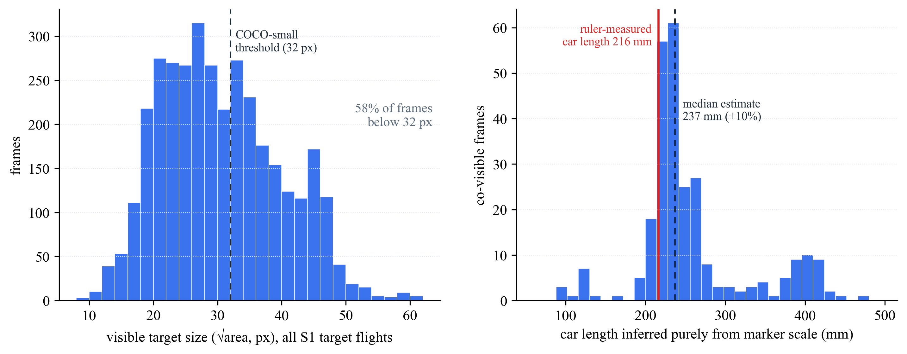

</details>

### Occlusion

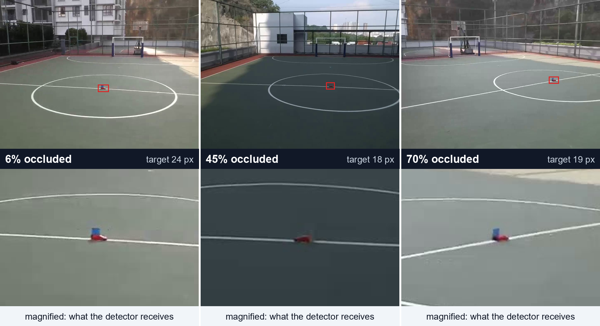

**The occluders.** At S2 a cardboard strip stands on the court beside the car at
54, 108 or 162 mm (25, 50 and 75 % of the car's length), and the aircraft orbits
it: once with no strip, then once per level. Each strip is 150 mm tall, 2.5 times the
car's height, so it covers the target's full height and the level is set by width
alone; and because a camera that comes too close sees over a strip, the geometry sets a
minimum standoff (2.3 m at 2 m altitude, less when flying higher), and the occluded
orbits were flown outside it. S3 repeats the design for the all-terrain vehicle, with
strips of 37.5, 75 and 112.5 mm. At S1 a backpack serves as a natural occluder (803
instances). S4 has no occluder at all.

**Deployed is not realised.** On an orbit the strip hides the target over one arc
and sits behind it over the opposite arc, so the deployed level is not what most
frames show. Realised occlusion is therefore measured per frame, as
`1 − area_occluded / area_clean`, against the frame of the clean lap taken from the
same viewpoint. Viewpoints are matched on the image rather than on telemetry: each
frame is reduced to a 32 × 24 greyscale descriptor with the target blanked out, so
it encodes the background alone. (Heading cannot do this: the aircraft yaws in place
while translating, so a heading recurs at different points of the orbit, and image
and heading matches disagree by a median of 30°.)

The method's noise floor was measured by matching the clean lap against itself,
where true occlusion is zero: at the operating match distance the error has a median
of 14.4 % and a 75th percentile of 31.8 %. Readings are banded conservatively:

| S2 deployed level | heavy (≥ 50 %) | partial (31.8–50 %) | indeterminate |
|---|---:|---:|---:|
| 25 % | 11 | 30 | 359 |
| 50 % | 65 | 43 | 258 |
| 75 % | 116 | 59 | 333 |

There is deliberately no "not occluded" band: an oblique strip that clips a small
part of the silhouette changes the area by less than the noise floor, so a low
reading means *not measurably occluded*, never *not occluded*. Frames guaranteed
clean come from the clean lap.

For scoring, every frame of the paired orbits carries one verdict for its ladder
target ([`occlusion_partition_s2.csv`](dataset/01_Dataset_SOCC_S2/occlusion_partition_s2.csv),
[`occlusion_partition_s3.csv`](dataset/01_Dataset_SOCC_S3/occlusion_partition_s3.csv)):
**OCCLUDED** (a frontal reading above the 31.8 % floor), **LIGHT** (frontal, below
the floor), **BYPASSED** (the camera is on the far side of the strip), **AMBIGUOUS**
(no viewpoint-matched clean frame) and **NOT_OCCLUDED** (the clean lap).

**Fully hidden targets.** 159 frames show the target's position with the target
entirely hidden: 141 in S1, in two unbroken runs of 72 and 69 frames behind the
backpack, and 18 in S2, 17 of them on the 75 % lap. The geometry predicts them: end
on, the car presents only its 90 mm width, and the 162 mm strip covers 180 % of it.
Each run is bracketed by frames in which the target shrinks and then vanishes. These
frames carry no box, so they cannot enter a recall band; they are used instead to
count detections fired where nothing is visible.

Occlusion also works through size. Among single-target frames of the S2 orbits, the
share of instances smaller than the clean lap's 5th percentile (20.1 px) rises from
15.1 % at 25 % deployed to 36.0 % at 50 % and 60.7 % at 75 %, where the smallest box
is 7.5 px: a continuum from fully visible to fully hidden that a pasted synthetic
mask, which removes a fixed fraction of the box, cannot reproduce.

<details>
<summary><b>Occlusion by orbit bearing at S1</b></summary>

The same orbit flown twice at matched height, once with the backpack beside the car.
On the clean lap the target is visible in every 30° sector; on the occluded lap its
visible size falls over part of the orbit and it disappears entirely across the
270–330° sectors, where camera, occluder and target align.

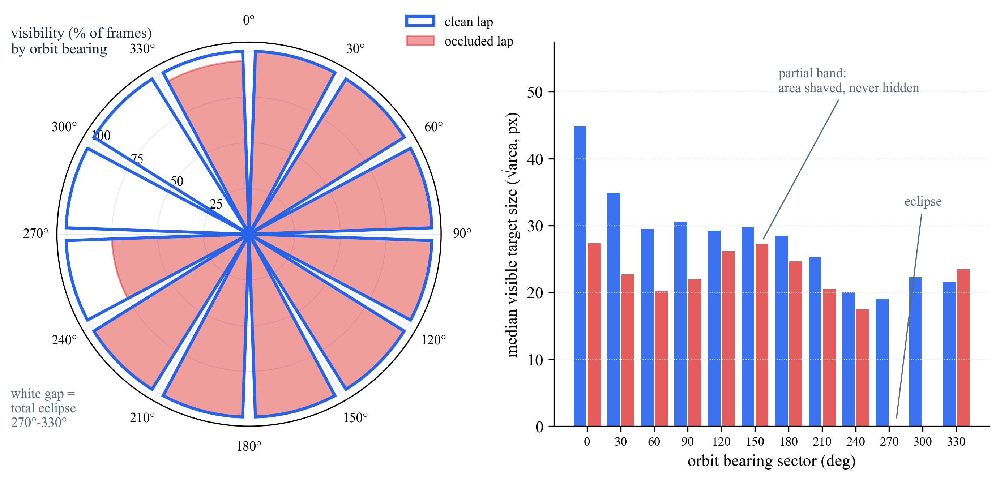

</details>

**The imagery and model weights are not in this repository.** Everything needed to
audit the results is: the labels, the per-frame manifests, the split of every frame,
the band ledgers with the raw counts behind every ratio, and the per-run training
records. The frames themselves (15,053 JPEGs at 960 × 720, with people blurred) and
the trained weights are available to researchers on request: open an issue on this
repository.

---

## The evaluation protocol

The study runs in four tiers on one fixed protocol: Tier 1 measures a standard
detector, Tier 2 changes its architecture, Tier 3 changes the detection paradigm, and
Tier 4 changes the training data, the checkpoint selection and the inference mode.
Every tier is scored on the same test split.

### The split

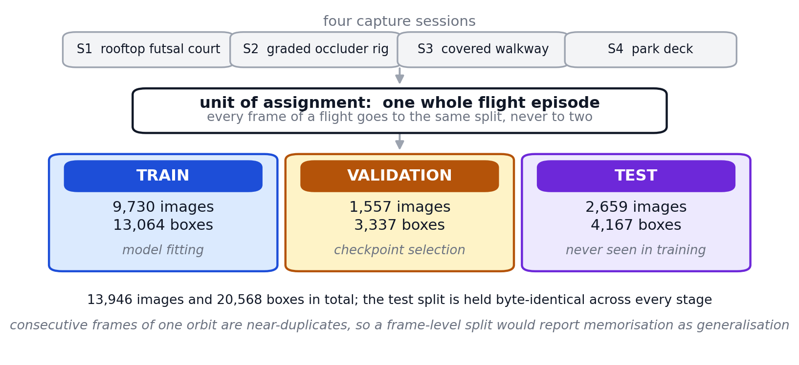

The split is by **whole flight family** (a flight card flown twice counts once),
never by frame: consecutive frames of one orbit are near-duplicates, and a
frame-level split would report memorisation as generalisation. All four sessions
are pooled, and each held-out family carries one of the benchmark's axes:

| Split | Flight families | Frames | Boxes |
|---|---|---:|---:|
| test | S2 75 % and 50 % orbits · S3 75 % orbit · S4 occ75 card · the two S1 backpack flights | 2,659 | 4,167 |
| validation | S3 hover pairs · S2 25 % orbit · S4 clean pair (Study M4 only) | 1,557 | 3,337 |
| train | everything else | 9,730 | 13,064 |

The test split holds 993 / 1,149 / 1,748 / 277 boxes in the four size bands, 395
OCCLUDED boxes, and all 159 fully hidden frames. Frames with the aircraft still on
the ground (time of flight ≤ 20 cm) are excluded from training and validation, which
leaves 1,141 released frames outside the partition; the test families keep theirs
(137 frames).

Two partitions share this **identical test split**, which is what makes every stage
comparable. *Study M* ([`study_M/assignment.csv`](results/protocol/study_M/assignment.csv))
was used for Tiers 1–3. Its validation split held only **6** sub-12-pixel boxes, so
checkpoint selection could barely see the band under study; *Study M4*
([`study_M4/assignment.csv`](results/protocol/study_M4/assignment.csv)) moves the S4
clean-pair family from training to validation, raising that to **129**, and is used
for Tier 4. Every venue appears on both sides of the split, so results measure
interpolation within these venues, not transfer to new ones. (The partition files
also list the 34 withheld frames, as empty negatives, 11 of them in test; no box and
no recall depends on them.)

### What is measured

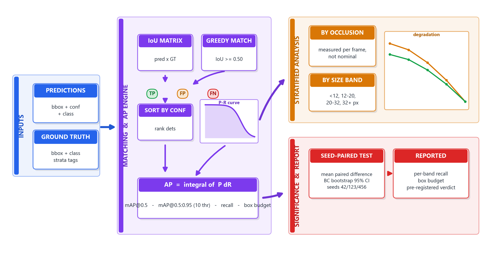

- **Recall per size band**: < 12, 12–20, 20–32 and 32+ px. A ground-truth box is
  found if a prediction of the same class overlaps it at IoU ≥ 0.5 (confidence
  0.25). Recall, not AP, is used per band because a false positive has no
  ground-truth size to be binned by. Class-agnostic recall is recorded beside it.
- **Recall per occlusion verdict**, from the measured partition, never from flight
  names.
- **Box budget**: predictions per image. Recall is blind to false positives, so a
  detector that emits more boxes gets more chances at the same target.
- **Ungrounded detections**: detections fired on the 159 test frames whose target is
  fully hidden, where nothing visible can justify a box.
- **mAP@0.5 and mAP@0.5:0.95**, for comparability only.

### Fixed before the runs

The analysis plans for Tiers 2, 3 and 4 were each written before that tier's first run
(Tier 1 is the measurement they build on) and are implemented by the analysis scripts in
[`code/`](code):

- **Primary endpoint:** recall in the < 12 px band on the test split.
- **Seeds:** 42, 123 and 456; every arm is compared with the baseline **on the same
  seed**, which removes seed variance.
- **Interval:** bias-corrected bootstrap 95 % CI of the mean paired difference over
  the seed pairs (10,000 resamples, RNG seed 0).
- **Decision rule:** *supported* only if the interval excludes zero **and** the mean
  difference exceeds **+0.02** absolute recall (about 20 of 993 boxes); *null* if
  the interval includes zero; *refuted* if it lies entirely below zero.
- **Box-budget guard:** an arm emitting more than **2.0×** its comparator's boxes per
  image cannot claim a recall gain.
- **Completion:** a configuration with fewer than three completed training runs is
  **underpowered** and gets no interval and no verdict. A run is complete when the
  trainer exited normally or early stopping ran its course.
- **Held constant:** input size 1280, batch 24, 8 dataloader workers, at most 100
  epochs with early-stopping patience 30, Ultralytics 8.4.126, and COCO-pretrained
  initialisation: yaml-built arms receive every COCO tensor whose name and shape
  still match (baseline 355/355, CBAM 270/364, P2 219/437, P2 + CBAM 219/449), so
  only genuinely new components start from random.
- **One correction corpus-wide:** hue jitter is reduced from the Ultralytics default
  0.015 to 0.005, because at 12–20 px a ±5.4° hue shift walks a red car toward orange
  and a yellow vehicle toward green, and colour is what carries the class at these
  sizes.
- **Multiplicity:** the Tier 4 plan names a Holm correction for its secondary
  contrasts. It is not applied, and no verdict depends on it: with three seed pairs,
  every interval that excludes zero comes from three paired differences of the same
  sign, which a wider interval cannot move, and every other interval already
  includes zero.

---

## Results

Tiers 1, 2 and 4 were trained on NVIDIA A40 GPUs and Tier 3 on H100s. Every number
below is re-derived from the ledgers by
[`code/verify_results.py`](code/verify_results.py).

### Tier 1: where a standard detector breaks

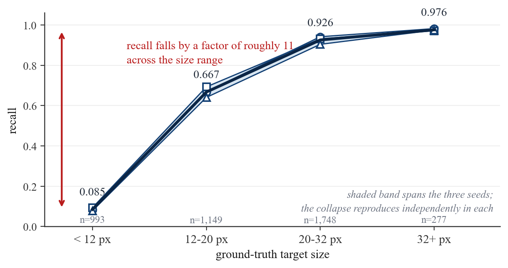

| Size band | Test boxes | seed 42 | seed 123 | seed 456 | mean |
|---|---:|---:|---:|---:|---:|
| < 12 px | 993 | 0.0836 | 0.0937 | 0.0785 | **0.0853** |
| 12–20 px | 1,149 | 0.6684 | 0.6928 | 0.6406 | 0.6673 |
| 20–32 px | 1,748 | 0.9416 | 0.9314 | 0.9039 | 0.9256 |
| 32+ px | 277 | 0.9819 | 0.9711 | 0.9747 | **0.9759** |

A COCO-pretrained YOLOv8n reaches a respectable **mAP@0.5 of 0.676** (sd 0.018 over
seeds; mAP@0.5:0.95 0.439; overall recall 0.614) and finds almost every target above
32 px, but recall falls by a factor of about **eleven** across the size range, and
the collapse reproduces in every seed (spread 0.015 in the smallest band against an
effect of 0.89). The detector is not mistaking small cars for something else. Scored
class-agnostically, sub-12-pixel recall barely moves (seed 123: 0.0937 → 0.0957), and
across the three seeds about **91 % of sub-12-pixel targets produce no box of any
class**.

By measured occlusion verdict, three-seed recall is 0.986 on BYPASSED boxes (239),
0.845 on AMBIGUOUS (500), 0.709 on LIGHT (47) and 0.878 on OCCLUDED (395). The
verdict bands differ in target size and venue as well as in occlusion, so they do not
form a clean ladder; an occlusion effect is read only as a seed-paired comparison
within one band, as in Tier 3.

**Why.** The frame reaches the network at 1280 px, 1.33 times its native width, and
a standard YOLOv8 head predicts from feature maps at stride 8, 16 and 32. A target
under 12 px therefore spans fewer than two cells of the finest map it is detected
from, and fewer than one at stride 16. A stride-4 level would give it four cells,
but it is not used for detection by default.

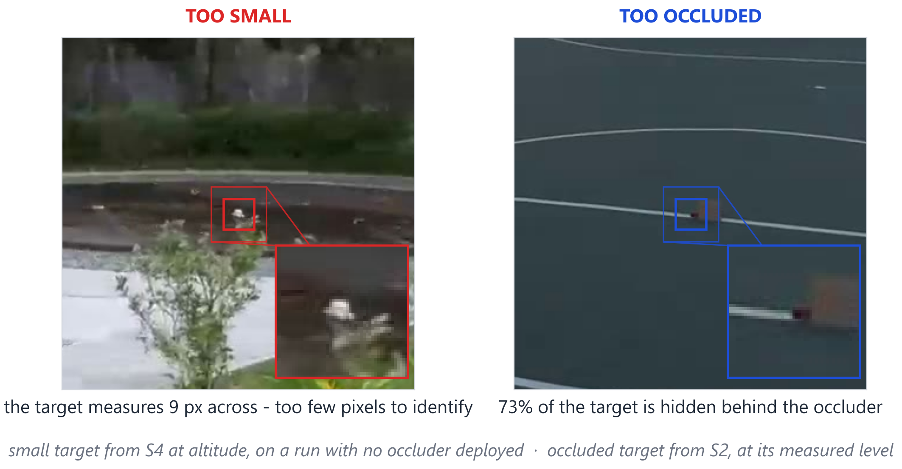

### Tier 2: architecture

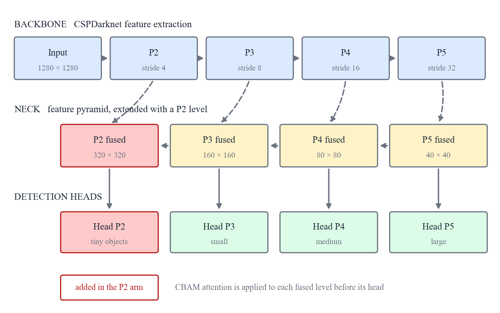

The three most-cited remedies were built on the same COCO-initialised YOLOv8n and
trained on the same split: a stride-4 **P2** detection level, **CBAM** attention on
every detection feature map, and the two together.

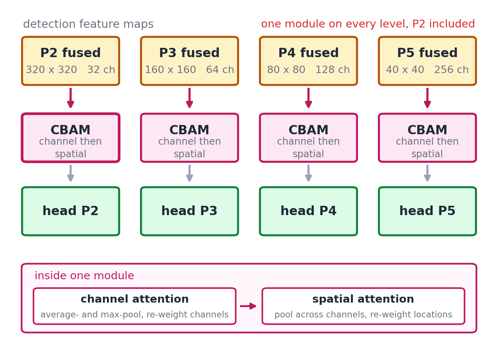

| Arm | Recall < 12 px | Paired Δ (95 % CI) | Inference | Verdict |
|---|---:|---|---:|---|
| Baseline | 0.0853 | reference | 3.5 ms | — |
| P2 detection level | 0.0859 | +0.0006 [−0.0051, +0.0060] | 6.0 ms | null |
| CBAM attention | 0.0675 | −0.0178 [−0.0232, −0.0144] | 3.6 ms | **worse than baseline** |
| P2 + CBAM | 0.0893 | +0.0040 [−0.0040, +0.0093] | 6.3 ms | null |

*Inference is per frame on an A40, from the batched scoring pass over the test
split.* P2 was predicted to help and did not (H1); CBAM was predicted to leave the
band unchanged and made it worse (H2); P2 + CBAM tracked P2, as predicted (H3).
Attention can only reweight features that carry signal, and at this scale none
survives the backbone.

### Tier 3: detection paradigm

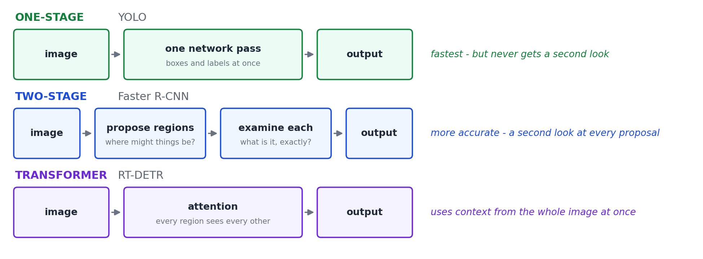

A two-stage detector (Faster R-CNN, ResNet50-FPN) and a transformer (RT-DETR-L) posted
the highest raw sub-12-pixel recalls of Tiers 1–3, and neither survives inspection:

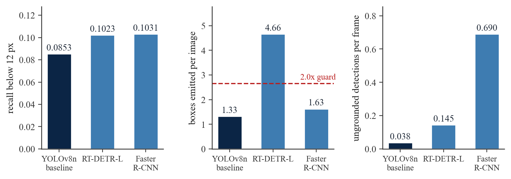

| Arm | Recall < 12 px | Paired Δ (95 % CI) | Boxes / image | Ungrounded / frame | Verdict |
|---|---:|---|---:|---:|---|
| YOLOv8n baseline | 0.0853 | reference | 1.33 | 0.038 | — |
| Faster R-CNN | 0.1031 | +0.0178 [−0.0212, +0.0470] | 1.63 | **0.690** | null |
| RT-DETR-L (2 seeds) | 0.1023 | +0.0212 (no interval) | **4.66** | 0.145 | underpowered; **3.5× box budget** |

- **Faster R-CNN**: its interval spans zero, and it fires 0.690 detections per frame
  on frames where the target is provably hidden, eighteen times the baseline's rate.
  Under occlusion it is measurably **worse** than the baseline (−0.0709
  [−0.0886, −0.0591] on the OCCLUDED boxes), the opposite of the prediction that
  region proposals help when part of an object is hidden (H5 falsified). Its three
  seed pairs alone span +0.0665, −0.0212 and +0.0081 in the sub-12-pixel band. One
  seed nearly doubles the baseline's recall there and another is worse, so a single-run
  comparison could have reported either conclusion.
- **RT-DETR-L**: one of its three runs was lost during training and not relaunched,
  so it is underpowered; and it emits 4.66 boxes per image against the baseline's 1.33,
  3.5× the budget, which disqualifies the gain regardless (H6).
- Both stay far below 0.20 in the sub-12-pixel band: the collapse is
  **paradigm-invariant** (H4 supported).

*The Tier 3 arms differ in training recipe as well as architecture: Faster R-CNN
trains with horizontal flip only, while the Ultralytics arms also use mosaic, scale,
HSV jitter and random erasing. RT-DETR's deformable attention has no deterministic CUDA
kernel, so its runs are not bit-reproducible; the CNN arms are.*

**Tiers 1–3 together:**

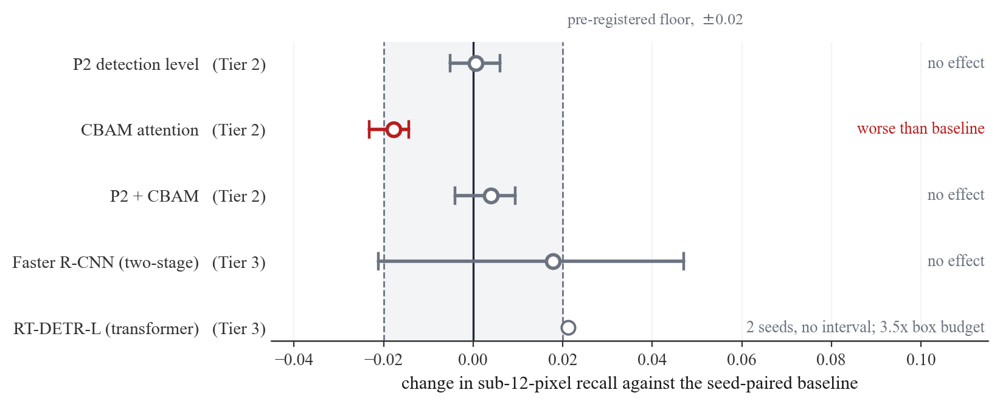

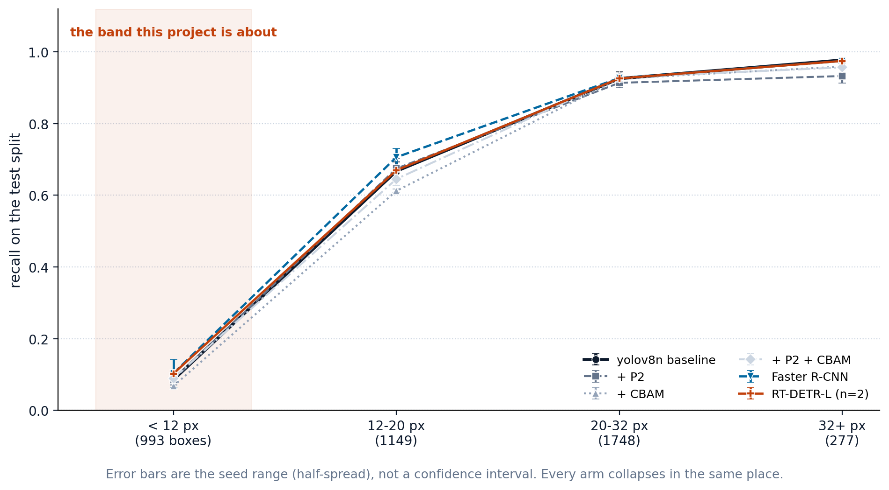

### Tier 4: data regime and inference

Tiers 2 and 3 changed the model. Neither set out to change what the model was shown
or how its checkpoint was chosen, and three measurements pointed there:

- the Study M training split is **2.9 %** sub-12-pixel boxes, while the test split is
  **23.8 %**;
- its validation split, which chooses the checkpoint, holds six such boxes
  (**0.2 %**);
- the `augmented` preset (scale jitter 0.75 instead of 0.5, 8° rotation) raises the
  share of sub-12-pixel boxes the network is actually shown from **4.8 %** to
  **17.6 %**.

Tier 4 therefore varies the training data, the checkpoint-selection split, the
backbone size and the inference mode, on Study M4, scoring every run twice: on the
whole frame, and over a 2 × 2 grid of overlapping tiles, each resized to the 1280 px
the model was trained on, so a 12 px target reaches the network at about 28 px
instead of 16 px:

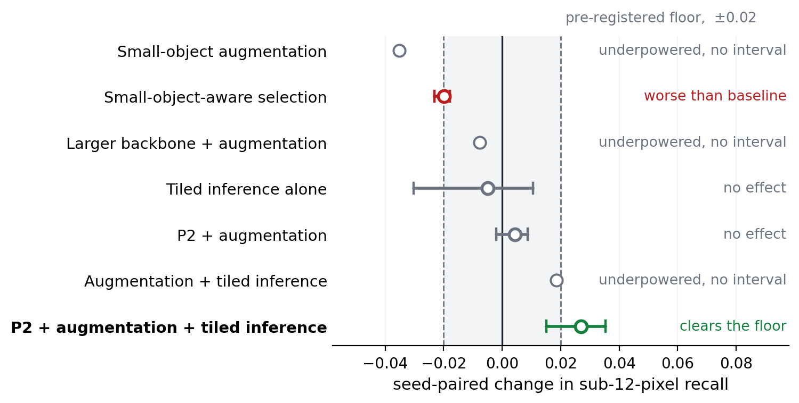

| Configuration (against the Tier 1 baseline) | Runs completed | Recall < 12 px | Paired Δ (95 % CI) | Verdict |
|---|---:|---:|---|---|
| Baseline, Study M | 3 of 3 | 0.0853 | reference | — |
| Small-object augmentation | 1 of 3 | 0.0500 | −0.0352 (no interval) | underpowered |
| Small-object-aware selection (Study M4) | 3 of 3 | 0.0655 | −0.0198 [−0.0232, −0.0178] | **worse than baseline** |
| Larger backbone (YOLOv8s) + augmentation | 1 of 3 | 0.0785 | −0.0076 (no interval) | underpowered |
| Tiled inference alone | 3 of 3 | 0.0802 | −0.0050 [−0.0303, +0.0105] | null |
| P2 + augmentation | 3 of 3 | 0.0896 | +0.0043 [−0.0021, +0.0087] | null |
| Augmentation + tiled inference | 1 of 3 | 0.1037 | +0.0185 (no interval) | underpowered |
| **P2 + augmentation + tiled inference** | 3 of 3 | **0.1121** | **+0.0269 [+0.0151, +0.0353]** | **clears the floor** |

Four training runs stopped before early stopping could trigger: one crashed while
saving a checkpoint at epoch 20, one stopped at epoch 36, one at epoch 85, and one
crashed at epoch 33 before it could be scored; the other three were scored from the
best checkpoint they had reached. Which runs completed decides which configurations carry
an interval; the per-run record (epochs run, best epoch, exit code, status) is
[`runs_t4/RUN_STATUS.csv`](results/protocol/runs_t4/RUN_STATUS.csv).

**The pre-registered contrasts**, each within Study M4 unless stated:

| Hypothesis | Contrast | Predicted | Observed |
|---|---|---|---|
| **H7** (primary) | augmentation, split held fixed | supported | **underpowered** (−0.0154; 1 of 3 augmented runs completed) |
| H8 | M4 selection vs Study M, preset held fixed | null | **refuted: worse** (−0.0198 [−0.0232, −0.0178]) |
| H9 | full training recipe vs the Tier 1 baseline | supported | underpowered (−0.0352) |
| H10 | tiled vs whole-frame, same weights | supported | null (+0.0148 [−0.0071, +0.0289]) |
| H10b | tiling on top of augmentation | supported | underpowered (+0.0537) |
| H11 | P2 on top of augmentation | supported | underpowered (+0.0396) |
| H12 | YOLOv8s vs YOLOv8n, both augmented | null | underpowered (+0.0296, 2 seeds) |

**Said plainly, because the pre-registration requires it:** the single pre-registered
*primary* hypothesis, augmentation alone, cannot be judged. The one configuration that
clears the floor is a *secondary* result, and its tiling component was added by a
dated amendment after a 120-frame, single-seed pilot and recorded as non-blind before
the confirmatory runs were launched ([`TILE_PROBE.txt`](results/protocol/results/tier4/TILE_PROBE.txt)).
All three of its runs completed. Under the conditions fixed in advance, neither the
training recipe (H7 and H9 are unsupported) nor tiled inference (H10 is null, and
tiling was not timed) is *proposed*; the configuration is reported as the best one
measured, with its cost.

### The best measured configuration, and what it costs

The gain exists **only as the combination**: a stride-4 detection level becomes useful
once training contains sub-12-pixel examples for it to learn from, and tiling then
presents those targets at a scale that level can resolve. On its own weights it passes
both guards: 1.23 boxes per image tiled against 1.25 whole-frame (0.98×), and 0.0985
ungrounded detections per frame against 0.0755 whole-frame, a rise that stays far below
the two-stage arm's 0.690.

| | Baseline, whole-frame | P2 + augmentation, 2 × 2 tiled |
|---|---:|---:|
| Recall < 12 px | 0.0853 | **0.1121** (+31 %) |
| Recall 32+ px | 0.976 | 0.929 |
| mAP@0.5 (both whole-frame) | 0.676 | 0.653 |
| mAP@0.5:0.95 (both whole-frame) | 0.439 | 0.421 |
| Overall recall (both whole-frame) | 0.614 | 0.608 |
| Boxes per image | 1.33 | 1.23 |
| Inference per frame | 3.5 ms (A40, batched) | ≈ 24 ms, *estimated* as four passes at the measured 6.0 ms |

The gain at the bottom of the size range is partly paid for at the top, aggregate
accuracy is essentially unchanged, and 2 × 2 tiling runs the network four times per
frame.

### All twelve hypotheses

| | Hypothesis | Predicted | Observed |
|---|---|---|---|
| H1 | P2 raises sub-12-pixel recall | supported | null |
| H2 | CBAM alone does not move it | null | refuted: worse |
| H3 | P2 + CBAM tracks P2 | supported | as predicted |
| H4 | the collapse is paradigm-invariant (every paradigm < 0.20) | supported | supported |
| H5 | Faster R-CNN is worse when small and better when occluded | supported | falsified: worse when occluded |
| H6 | RT-DETR-L does not exceed the baseline by more than the floor | supported | underpowered, and over the box budget |
| H7 | small-object augmentation raises recall | supported | underpowered |
| H8 | small-object-aware selection alone is not sufficient | null | refuted: worse |
| H9 | the full training recipe beats the standard one | supported | underpowered |
| H10 | tiled inference raises recall within the budget guard | supported | null |
| H10b | tiling still helps once training emphasises small objects | supported | underpowered |
| H11 | P2 helps once it has small examples to learn from | supported | underpowered |
| H12 | model scale moves the band | null | underpowered |

---

## Limitations

- **The two axes are partly confounded by venue.** Occlusion was staged at the rooftop
  court (S1, S2) and the walkway (S3); the sub-12-pixel population lives almost
  entirely at the park deck (1,287 of 1,414), which has no occluder. No result here
  ranks occlusion against scale, or attributes an effect to *occlusion at small
  scale*.
- **Within-venue split.** Every venue contributes to both training and test, so the
  results measure interpolation within these venues, not transfer to new ones. One
  corpus and one aircraft; generalisation beyond them is untested.
- **Three seeds.** Intervals over three seed pairs are wide, four Tier 4 runs did not
  complete and RT-DETR-L has two seeds, so several hypotheses remain open.
- **Speed is indicative.** Inference was timed on A40s for the YOLOv8 arms and on
  H100s for RT-DETR-L, so paradigms are not compared on matched hardware; Faster R-CNN
  was timed only on CPU (6.3× the baseline); tiled inference was not timed.
- **Occlusion measurement has a floor.** Realised occlusion below about 32 % cannot be
  distinguished from none, and oblique partial occlusion is not detected.
- **Sizes are in pixels.** The marker-plane scale is exact only at the marker's plane,
  so no metric size is given.
- **No inter-annotator agreement.** Every label was reviewed, but no agreement between
  independent annotators has been measured.
- **The baseline was scored more than once.** Two cells differ by one detection between
  passes (32+ px, seed 123: 269 or 270 of 277; 20–32 px, seed 456: 1,580 or 1,579 of
  1,748). Each tier's analysis pairs against the baseline rows in its own ledger; no
  verdict depends on the difference.

## Open questions

- **Transfer.** Running the identical protocol on a large public UAV benchmark would
  show whether the sub-12-pixel floor belongs to this capture set-up or to the problem.
- **The venue confound.** Occluded paired orbits flown at the heights that produce
  sub-12-pixel targets would let the interaction of the two axes be estimated.
- **Paired training signal.** The paired orbits give the same target, scene and bearing
  with and without an occluder, which is the pairing that consistency-based occlusion
  training needs, here by construction.
- **Crowding and new venues.** Denser scenes, and venues held out entirely, would test
  inter-object occlusion and cross-venue transfer.
- **Deployment cost.** Timing tiled inference, and quantising the network, on the
  hardware a UAV actually carries would complete the cost side of the best configuration.

---

## Repository layout

```
dataset/        one folder per session (01_Dataset_SOCC = S1, _S2, _S3, _S4)
  release/labels/      YOLO labels, one file per released frame
  release/*_manifest   per-frame release manifest (S2–S4)
  *_frames_manifest    per-frame capture record: height, heading, attitude, occlusion
  occlusion_partition  measured occlusion verdicts (S2, S3)
  release/socc_coco.json, socc_instances.csv, FULLY_OCCLUDED_S1.csv   (S1)
capture/captures/   per-flight telemetry, frame times, event marks and stick traces
results/protocol/
  study_M/, study_M4/  the split of every frame (assignment.csv) and the dataset yamls
  results/             merged band ledgers (BANDS*.csv), per-run metrics (RESULTS*.csv),
                       inference speed, epochs per run, the Tier 1 per-epoch logs,
                       the Tier 4 table, the tiling pilot
  runs_t2/ .. runs_t4/ per-run ledgers; Tier 4 adds args.yaml, the per-epoch log
                       and RUN_STATUS.csv
code/           trainers, scorers, tiled inference, analyses, verifier, figure scripts
  models/              the CBAM architecture yamls
figures/        every figure in this README
```

## Reproducing the numbers

Everything below runs from a fresh clone, without the imagery (verified with
Python 3.11):

```bash
pip install -r requirements.txt      # numpy and matplotlib are enough for everything that does not train

python code/verify_results.py        # every number in this README, re-derived from the CSVs
python code/analyse_tier2.py         # H1–H3
python code/analyse_tier3.py         # H4–H6, box budget, ungrounded detections
python code/analyse_tier4.py         # H7–H12 and the proposal conditions
python code/make_tier4_table.py      # Tier 4 against the Tier 1 baseline (writes TIER4_VS_BASELINE.csv)
python code/merge_runs.py            # rebuilds the Tier 2 ledger from runs_t2/ (add --apply to write)

python code/make_result_figures.py   # size histogram, class balance, size collapse, interventions, box budget
python code/make_band_figure.py      # recall by size band, every Tier 1–3 arm
python code/make_split_figure.py     # the split, counted from study_M4/assignment.csv
python code/make_tier4_figure.py     # the Tier 4 forest plot
```

With matplotlib 3.10.3 and the same fonts, the figure scripts reproduce the committed
PNGs pixel for pixel, and byte for byte when Pillow 11.2.1 encodes them. Training and
scoring need the imagery, placed under
`results/protocol/study_*/images/{train,val,test}` with labels populated from each
study's `assignment.csv`:

```bash
python code/train_protocol.py --study M4 --model yolov8n-p2 --preset augmented --seed 42 --batch 24 --workers 8
python code/score_bands.py --weights <run>/weights/best.pt --study M4 --tag M4_yolov8n-p2_augmented_s42
python code/tile_probe.py --weights <run>/weights/best.pt --data results/protocol/study_M4/socc_study_M4.yaml \
    --tiles 2 --device 0 --csv BANDS_tiled.csv --tag M4_yolov8n-p2_augmented_s42_tiled2
python code/train_frcnn_protocol.py --study M --seed 42 --batch 24
```

## Data format

**Labels**: one text file per released frame, one line per box:
`class x_center y_center width height`, normalised to the 960 × 720 frame. Classes:
`0 rc_car`, `1 atv_sherp`, `2 truck_peterbilt`. A released frame with no target has an
empty file. Frames are named `<flight>_f<6-digit frame index>.jpg` (for S1 the
prefix is the source recording).

<details>
<summary><b>Manifest columns</b></summary>

**Capture manifests** (`socc_*frames_manifest.csv`, one row per extracted frame):

| Column | Meaning |
|---|---|
| `image`, `flight_key`, `stem`, `role`, `frame_idx` | frame name, flight card, source recording, card role, index in the recording |
| `t_rel` | capture time, seconds from the start of the recording |
| `tof_cm`, `height_cm`, `height_src` | time-of-flight altitude, fused height, and which one a height came from (S4) |
| `yaw_deg`, `pitch_deg`, `roll_deg`, `battery_pct` | attitude and battery from telemetry |
| `aruco_px`, `gsd_at_mat_mm_px` | marker side in pixels and the marker-plane scale, where a marker was detected |
| `capture_class` | S4: `benchmark` flight, `test` (altitude hold over empty ground), `ground` (never airborne), `aborted` |
| `segment`, `is_anchor` | flight segment, and frames marked in flight as reference anchors |
| `occ_strip_mm`, `occ_deployed_pct` | the occluder set up for the flight |
| `occ_realised_pct`, `occ_realised_band`, `occ_realised_match_dist`, `occ_realised_ref_image` | S2: measured occlusion, its conservative band, the viewpoint-match distance (lower is better; above 14 is not trustworthy) and the clean-lap reference frame |
| `fully_occluded` | S2: target present and completely hidden |
| `usable`, `has_car`, `sharpness`, `quality`, `quality_tier`, `green_frac`, `blur`, `tags` | capture quality: decoder corruption, motion blur, attitude excursions |

**Release manifests** list the released frames. The S2 manifest carries the capture
columns above; the S3 and S4 manifests give `n_boxes`, `classes`, `quality_flag`
(`ok`, `confirmed_empty`, `bad_frame`), `manifest_quality` and `occ_deployed_pct`,
plus `review_provenance` (`human_confirmed` or `model_accepted_bulk`) for S3 and
`capture_class` and `height_cm` for S4.

**Occlusion partitions** (`occlusion_partition_s2.csv`, `_s3.csv`): `image`, `flight`,
`target` (the ladder target the verdict describes), `realised`, `match_dist`,
`yaw_deg`, `verdict`, `reason`.

**S1 extras:** `socc_coco.json` (COCO-format export of S1), `socc_instances.csv` (one
row per instance with size, height, heading and occluder) and `FULLY_OCCLUDED_S1.csv`
(the 141 fully hidden frames and the run each belongs to).

**Flight logs** (`capture/captures/<recording>.*.csv`): `telemetry` (`t_rel`,
time-of-flight and fused heights, `baro_rel_cm`, heading, attitude, battery), `frames`
(frame index to time), `events` (`takeoff`, `MARK`, `land`) and, for S4, `replay`
(stick commands, for re-flying a card). Every `t_rel` is seconds from the earliest
logged row of that recording, and `baro_rel_cm` is the barometer reading relative to
the recording's first; absolute timestamps and barometer readings are not published.
Two recordings were aborted before the video stream delivered a frame
(`S2_futsal_occ75_20260808_085551`, `S4_park_sizesweep_20260818_174828`): their
telemetry is kept, their frame and event logs (and, for the S4 one, the stick log)
are empty, and each card was flown again. S3 recordings carry the session's working name `court2`; the venue is
the covered walkway.

**Result ledgers:** `BANDS*.csv` rows are `tag, slice, n, found, recall,
recall_any_class`, where a slice is a size band, an occlusion verdict, a class,
`pred_budget` (n = images, found = predictions) or `halluc_fullyocc` (n = fully hidden
frames, found = detections on them). `RESULTS*.csv` hold the per-run mAP, precision,
recall, training time and GPU.

</details>

## Licence and citation

Code: **MIT** ([`LICENSE`](LICENSE)). Labels, manifests, flight logs, measured results
and figures: **CC BY 4.0** ([`LICENSE-DATA`](LICENSE-DATA)). To cite, use
[`CITATION.cff`](CITATION.cff) or the *Cite this repository* button.
